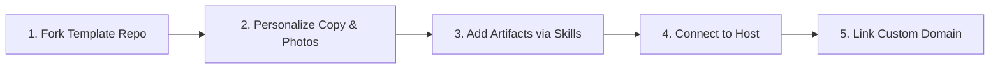

# Deployment & Production Guide

This guide details the complete deployment lifecycle for the **Astro Marketing Portfolio Template**. Whether you are deploying an instance for yourself or forking this template for a client, follow the workflows below.

---

## 1. The Fork-to-Deploy Lifecycle

When provisioning a portfolio for a new user or client:



1. **Fork or Branch the Repository**:
   - In GitHub, click **Fork** (or create a dedicated client branch).
2. **Personalize Branding & Visuals**:
   - Replace portraits: `public/images/portrait-hero.jpg` and `public/images/portrait.jpg`.
   - Update metadata, titles, and biography in `src/pages/index.astro` and `src/layouts/Layout.astro`.
   - Update favicon if desired: `public/favicon.svg`.
3. **Curate Case Studies**:
   - Use the `create-artifact` and `remove-artifact` skills to add real case studies with custom metrics, preview covers, videos, or collateral.
4. **Deploy & Attach Custom Domain**:
   - Choose your preferred hosting option below.

---

## 2. Comparison of Deployment Options

Because Astro produces static HTML/CSS/JS (`output: 'static'`), the site requires **no backend server or database** in production.

| Option | Best For | Cost | Bandwidth | Custom Domain & SSL | Setup Effort |
|---|---|---|---|---|---|
| **[Cloudflare Pages](#option-1-cloudflare-pages-recommended)** *(Top Pick)* | Production client sites & high-traffic portfolios | **100% Free** | **Unlimited** | 1-Click Auto SSL | 2 minutes |
| **[Vercel](#option-2-vercel)** | Rapid setups & agency branch previews | **Free tier** | 100 GB / month | 1-Click Auto SSL | 1 minute |
| **[GitHub Pages](#option-3-github-pages-built-in)** | Open-source or developer portfolios on GitHub | **100% Free** | 100 GB / month | Built-in via CNAME | 1 minute (Pre-configured) |
| **[Docker / Self-Hosted](#option-4-docker--self-hosting-vps--coolify)** | Private VPS, Coolify, Portainer, or enterprise networks | Server cost ($5/mo) | VPS dependent | Reverse proxy (Caddy/Traefik) | 5 minutes |

---

## Option 1: Cloudflare Pages (Recommended)

Cloudflare Pages provides an Anycast global CDN with unlimited bandwidth, making it the ideal host for media-rich marketing portfolios.

### Step-by-Step Setup:
1. Log in to the [Cloudflare Dashboard](https://dash.cloudflare.com/) and navigate to **Workers & Pages** > **Create application** > **Pages** > **Connect to Git**.
2. Select your forked portfolio repository.
3. Configure the build settings:
   - **Framework preset**: `Astro`
   - **Build command**: `npm run build`
   - **Build output directory**: `dist`
   - **Node.js version**: Cloudflare automatically uses Node 18/20. (Optional: Add an environment variable `NODE_VERSION` = `20`).
4. Click **Save and Deploy**.
5. Your site is live immediately at `https://<project-name>.pages.dev`.

### Custom Domain on Cloudflare Pages:
1. In your Pages project, go to **Custom Domains** > **Set up a custom domain**.
2. Enter your domain (e.g. `portfolio.yourdomain.com` or apex `yourdomain.com`).
3. If your domain's DNS is managed by Cloudflare, it configures DNS automatically with 1 click.
4. If managed elsewhere (e.g. GoDaddy, Namecheap), add the provided `CNAME` record in your DNS provider's portal. Cloudflare will automatically issue a free universal SSL certificate.

---

## Option 2: Vercel

Vercel offers zero-config Astro detection and preview URLs for every pull request.

### Step-by-Step Setup:
1. Log in to [Vercel](https://vercel.com/) and click **Add New...** > **Project**.
2. Import your GitHub portfolio repository.
3. Vercel automatically detects the **Astro** framework:
   - **Build Command**: `astro build` (or `npm run build`)
   - **Output Directory**: `dist`
   - **Install Command**: `npm install`
4. Click **Deploy**. Your site will build in ~30 seconds.

### Custom Domain on Vercel:
1. Navigate to **Project Settings** > **Domains**.
2. Enter your custom domain (e.g., `janedoe.com` and `www.janedoe.com`).
3. Add the DNS records shown by Vercel in your DNS manager:
   - For apex domain: `A` record pointing to `76.76.21.21`
   - For `www` subdomain: `CNAME` record pointing to `cname.vercel-dns.com`
4. SSL certificates are provisioned automatically within minutes.

---

## Option 3: GitHub Pages (Built-in Workflow)

A pre-configured GitHub Actions workflow is included at [`.github/workflows/deploy.yml`](.github/workflows/deploy.yml).

### Step-by-Step Setup:
> [!IMPORTANT]
> **Private Repositories & GitHub Pages**:
> GitHub Pages is free for **public** repositories. For **private** repositories, GitHub Pages requires a **GitHub Pro** (or Team/Enterprise) subscription.
> If your repository is private and you want a 100% free deployment without paying for GitHub Pro, use **Cloudflare Pages** or **Vercel**, both of which connect to private GitHub repos for free.

1. In your GitHub repository, navigate to **Settings** > **Pages**.
2. Under **Build and deployment** > **Source**, select **GitHub Actions**.
3. Push any commit to the `main` branch:
   ```bash
   git push origin main
   ```
4. Navigate to the **Actions** tab to watch the workflow build and deploy the site.

### Custom Domain on GitHub Pages:
1. In **Settings** > **Pages** > **Custom domain**, enter your domain name (e.g. `portfolio.yourdomain.com`).
2. Click **Save** (this will create a `CNAME` file in your repository).
3. At your DNS provider:
   - For apex domain: Create 4 `A` records pointing to GitHub's IPs:
     ```text
     185.199.108.153
     185.199.109.153
     185.199.110.153
     185.199.111.153
     ```
   - For `www` subdomain: Create a `CNAME` record pointing to `<your-username>.github.io`.
4. Check the box **Enforce HTTPS** once DNS resolves.

---

## Option 4: Docker & Self-Hosting (VPS / Coolify)

If you self-host on a Linux VPS (DigitalOcean, Hetzner, Linode) or use self-hosted PaaS solutions like **Coolify**, **CapRover**, or **Portainer**, use the included multi-stage [`Dockerfile`](./Dockerfile) and [`nginx.conf`](./nginx.conf).

### Local Docker Build & Test:
```bash
# Build the production Docker container
docker build -t astro-portfolio:latest .

# Run the container on port 8080
docker run -d -p 8080:80 --name my-portfolio astro-portfolio:latest

# Open in browser
open http://localhost:8080
```

### Docker Compose Configuration (`docker-compose.yml`):
```yaml
version: '3.8'

services:
  portfolio:
    build: .
    container_name: marketing-portfolio
    restart: unless-stopped
    ports:
      - "80:80"
    healthcheck:
      test: ["CMD", "wget", "--quiet", "--tries=1", "--spider", "http://localhost/"]
      interval: 30s
      timeout: 3s
      retries: 3
```

### Automatic Reverse Proxy & HTTPS with Caddy:
If running on a VPS with [Caddy](https://caddyserver.com/):
```caddyfile
yourdomain.com, www.yourdomain.com {
    reverse_proxy localhost:8080
}
```
Caddy will automatically acquire and renew Let's Encrypt SSL certificates.

---

## 3. Custom Domain Configuration Reference

When configuring DNS at registrars like GoDaddy, Namecheap, Google Domains / Squarespace, or Porkbun:

| Type | Name / Host | Target / Value | Purpose |
|---|---|---|---|
| **A** | `@` (apex) | IP provided by host (e.g. Vercel `76.76.21.21` or GitHub IPs) | Directs `yourdomain.com` |
| **CNAME** | `www` | Provided CNAME host (e.g. `<project>.pages.dev` or `cname.vercel-dns.com`) | Directs `www.yourdomain.com` |
| **CNAME** | `portfolio` *(if subdomain)* | Provided CNAME host | Directs `portfolio.yourdomain.com` |

> [!TIP]
> **DNS Propagation**: DNS updates typically propagate within 5–15 minutes, but can take up to 24–48 hours depending on TTL settings.

---

## 4. Ongoing Update & Publishing Workflow

Once your deployment is linked to GitHub:

1. **Local Development**:
   ```bash
   npm run dev
   ```
2. **Add / Edit Artifacts**:
   - Use the AI skill or manual markdown files in `src/data/artifacts/`.
   - Run `node .agents/scripts/artifact-manager.mjs consolidate` to keep order numbers clean.
3. **Verify Locally**:
   ```bash
   npm run check && npm run build
   ```
4. **Deploy Live**:
   ```bash
   git add .
   git commit -m "feat: add new enterprise rebrand case study"
   git push origin main
   ```
   **That's it!** The connected platform (Cloudflare Pages, Vercel, or GitHub Actions) detects the push, runs the build, and publishes the update globally in ~30 seconds with **zero downtime**.
